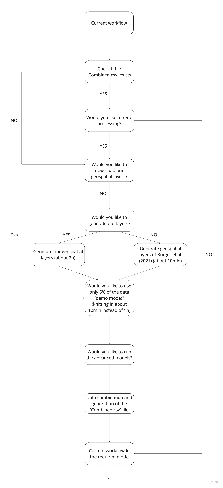

Course: Proseminar in Applied Geo-Data Science at the University of Bern
(Institute of Geography)

Supervisor: Prof. Dr. Benjamin Stocker

Adviser: Dr. Laura Marques, Pepa Aran

Further information: <https://geco-bern.github.io/agds_proseminar/>

[Do you have questions about the workflow? Contact the
authors:]{.underline}

Tinner Nils (nils.tinner\@students.unibe.ch) had the lead for the work
package 1 (WP1):

-   Data wrangling

-   Data (pre)processing

-   Open sciences and reproducible workflow

-   Advanced models (XGB and neuronal network)

Bigler Patrick (patrick.bigler1\@students.unibe.ch) had the lead for the
work package 2 (WP2):

-   Model implementation and calculations

-   Model tuning

-   Model evaluation

-   Visualization of the key findings

-   Structure and design of this markdown and the workflow

\-\-\-\-\-\-\-\-\-\-\-\-\-\-\-\-\-\-\-\-\-\-\-\-\-\-\-\-\-\-\-\-\-\-\-\-\-\-\-\-\-\-\-\-\-\-\-\-\-\-\-\-\-\-\-\-\-\-\-\-\-\-\-\-\-\-\-\-\-\-\-\-\-\-\-\-\-\-\-\-\-\-\-\-\-\-\-\-\--

# Introduction^WP1, WP2^

Climate change, influenced by human activities, is likely to increase the
frequency, intensity, and length of heatwaves, as discussed in studies like
(IPCC, 2023). In urban settings, this effect is intensified by the urban
heat island (UHI) phenomenon, which results in higher temperatures in city
areas than in surrounding rural regions, as explored in works like
@oke2017. This discrepancy is particularly pronounced at night due to
reduced long-wave radiation emission and altered heat fluxes in urban areas
[@burger2021; @gubler2021]. Consequently, urban residents face significant
thermal stress from the UHI effect [@burger2021; @wicki2018]. With over 75%
of the Central European population residing in urban zones, this escalating
trend is a major climatic concern for these inhabitants. Therefore,
examining the spatial variability of temperatures in urban areas is
essential for developing adaptation strategies to mitigate impacts on
public health and the environment [@burger2021].

In order to accurately monitor temperature variations in climatically
diverse urban areas, there is a need for high-resolution measurement
networks. The scarcity of automated weather stations (AWS) due to their
high cost poses a challenge in this regard. Addressing this issue,
@gubler2021 introduced a novel, cost-effective type of measurement devices
(Low Coast Devices, LCDs). These devices comprise a temperature logger and
a specially designed, naturally ventilated radiation shield. In 2018, 79 of
these LCDs were deployed across Bern, Switzerland [@gubler2021]. The
research found that, compared to the AWS reference station, the LCDs tended
to overestimate the average hourly temperatures during the day (06:00 --
22:00) by 0.61°C to 0.93°C. At night (22:00 -- 06:00), the discrepancies
were significantly smaller, ranging from -0.12°C to 0.23°C. The study not
only focused on the temperature readings from the LCDs and their variance
from AWS data but also mapped the temperature distribution across the
suburban areas of Bern, providing a comprehensive overview [@gubler2021].

In spring 2023, N. Tinner generated a map of the current LCDs temperature
in the city of Bern based on the study of @burger2021. Here, a spatial
upscaling from single measurement points of temperature is performed for a
night mean based on spatial predictors and meteorology, which are known
causes for the UHI [@oke2017]. N. Tinner implemented an approach where the
upscaling is performed on real time data. The approach used is a classic
multivariate linear regression model. As the model only knows the current
temperature distribution, its scope and statistical power are limited. But
because both @burger2021 and @gubler2021 showed that the city of Bern is
affected by the urban heat island effect it is crucial to know more about
it. Therefore @burger2021 modelled the nighttime mean UHI effect. The fact
that the first real time map of N.Tinner is very limited in its statistical
power and @burger2021 only modeled nighttime mean motivated us to
investigate the urban heat island using machine learning techniques.

## Objectives and Research Questions

@burger2021 used a multiple linear regression approach to model the urban
heat island effect in the city of Bern for a night-time mean. In this study
we aim to calculate our own models at an hourly rate all day. Furthermore,
we will implement a classic approach (multiple linear regression model) and
machine learning approaches (k-nearest neighbors (knn) and random forest).
We use two sets of geospatial layers. First, we use the same set as
@burger2021 with the same zonal mean per predictor class. The predictor
class represents the original layer without processing, for example the
vegetation height. These are cut to the extent of the city and its
surrounding lands as well as a spatial resolution of 5 meters and will be
in the raw-data folder. But since @burger2021 was selecting layers with
night-time mean modelling in mind this study also uses generated geospatial
layers with several zonal mean distances per predictor class (these will be
introduced in the data section). Therefore, the following questions arise:

1.  Are the two machine learning approaches (knn and random forest)
    reasonable approaches for modeling the urban heat island effect in the
    city of Bern in terms of explaining the variance ($R^2$), the precision
    (RMSE) and the accuracy (bias)?
2.  Are the machine learning approaches superior to a multiple regression
    model in terms of explaining the variance ($R^2$), the precision (RMSE)
    and the accuracy (bias)?
3.  How do models with the geospatial layers of @burger2021 compare to our
    models containing several zonal means per predictor class in terms of
    explaining the variance ($R^2$), the precision (RMSE) and the accuracy
    (bias)?
4.  Can a meaningful map be generated from the best model that shows the
    spatial distribution of the temperature anomaly in the suburban area of
    the city of Bern?

# Data and Methodology

In this section, we introduce you to the data used and the methodology.
First, we present the data employed in our study. Second, we delve into the
methodology, starting with the processing of the geospatial layers.
Moreover, we give an explanation of how we determined which variables to
use. To address our research questions, we implemented different modes to
run this workflow. We provide an overview about those modes and guide you
through. At last, we explain how we implemented the models.

## Data^WP1^

To avoid misunderstanding we want to start with a brief clarification: This
project uses cantonal land use data and federal geospatial data. These in
their raw form are called predictor classes. These are then spatially
averaged to obtain the actual predictors which are called geospatial layers
or just predictors.

Temperature data for the years 2019-2022 from the network of the city of
Bern is used. This is a numerical data set of the 3m temperature in 104
locations, with a temporal resolution of 10 minutes for all LCDs. How many
LCD are active depends on the year but 55 LCDs are active over the entire
time period (see table 1). The network data is publicly available on BORIS,
however since data on BORIS is faulty at the moment we uploaded the
corrected .csv-files to the Github repository. The original files can be
found [here](https://boris.unibe.ch/161882/), as well as the metadata
containing the logger location. We use additional data from the
MeteoSchweiz AWS at Zollikofen, as it is the official meteorologic station
of Bern. The five meteorological variables (2m temperature, precipitation,
radiation, wind direction and wind speed) with a temporal resolution of 10
minutes for the years 2019-2022 will be used as well as the timestamp. Data
of temperature (average) and precipitation (sum) of the previous six and
twelve hours, and one, three and five days (and additionally ten days for
precipitation) will also be fed into the model. This data is uploaded to
the repository to ensure availability since the IDAWEB-data service is open
for scientific use but not completely open access. To show small scale
urban patterns of temperature distributions, zonally meaned geospatial data
as shown in [\@burger2021](mailto:in@burger2021){.email} is used. These are
cantonal land use classes as well as federal geospatial data. All of the
data is spatially averaged to obtain the layers most effective as shown in
@burger2021 as well as with our own distances (Table 1). The federal data
(meteorologic values from the AWS at Zollikofen, digital elevation model
(DEM), and vegetation height (VH)) and cantonal data (all land cover
classes: land cover (LC), different open spaces (OS) and building heights
(BH)) is directly downloaded from the web into R and then used as predictor
classes. The geospatial layers roughness (ROU), flow accumulation (FLAC),
aspect (ASP) and slop (SLO) are calculated based on these data sets and are
then used as predictor classes. Table 1 provides a brief overview of the
data we use.

+----------------------------+-----------------+-------------------------+
| Predictor class            | Variable Type   | Resolution / zonal mean |
|                            |                 | [used resolutions /     |
|                            |                 | zonal means]            |
+============================+=================+=========================+
| 2m Temperature in °C       | Meteorological  | 15 minutes / [1h mean,  |
| [Zollikofen] for the time  |                 | 6, 12, 24, 72, 120      |
| period 2019 - 2022         |                 | hours rolling mean]     |
+----------------------------+-----------------+-------------------------+
| Precipitation in mm        | Meteorological  | 15 minutes / [1h mean,  |
| [Zollikofen] for the time  |                 | 6, 12, 24, 72, 120, 240 |
| period 2019 - 2022         |                 | hours rolling sum]      |
+----------------------------+-----------------+-------------------------+
| Radiation in $W*m^{-2}$    | Meteorological  | 15 minutes / [1h mean]  |
| [Zollikofen] for the time  |                 |                         |
| period 2019 - 2022         |                 |                         |
+----------------------------+-----------------+-------------------------+
| Windspeed in $m*s^{-1}$    | Meteorological  | 15 minutes / [1h mean]  |
| [Zollikofen] for the time  |                 |                         |
| period 2019 - 2022         |                 |                         |
+----------------------------+-----------------+-------------------------+
| Winddirection in °         | Meteorological  | 15 minutes / [1h mean]  |
| [Zollikofen] for the time  |                 |                         |
| period 2019 - 2022         |                 |                         |
+----------------------------+-----------------+-------------------------+
| Land Cover Building [LC_B] | Geospatial      | [25m / 150m / 1000m],   |
|                            | Layer           |                         |
|                            |                 | Burger used [250m]      |
+----------------------------+-----------------+-------------------------+
| Open Space Forest [OS_FO]  | Geospatial      | [[25m / 150m / 1000m],  |
|                            | Layer           |                         |
|                            |                 | Burger used [250m]      |
+----------------------------+-----------------+-------------------------+
| Open Space Garden [OS_GA]  | Geospatial      | [25m / 150m / 1000m],   |
|                            | Layer           |                         |
|                            |                 | Burger used [25m]       |
+----------------------------+-----------------+-------------------------+
| Open Space Sealed [OS_SE]  | Geospatial      | [25m / 150m / 1000m],   |
|                            | Layer           |                         |
|                            |                 | Burger used [500m]      |
+----------------------------+-----------------+-------------------------+
| Open Space Agriculture     | Geospatial      | [25m / 150m / 1000m],   |
| [OS_AC]                    | Layer           |                         |
|                            |                 | Burger used [500m]      |
+----------------------------+-----------------+-------------------------+
| Open Space Water [OS_WA]   | Geospatial      | [25m / 150m / 1000m],   |
|                            | Layer           |                         |
|                            |                 | Burger used [150m]      |
+----------------------------+-----------------+-------------------------+
| Vegetation Height [VH]     | Geospatial      | [25m / 150m / 1000m],   |
|                            | Layer           |                         |
|                            |                 | Burger used [150m]      |
+----------------------------+-----------------+-------------------------+
| Mean Building Heights [BH] | Geospatial      | [25m / 150m / 1000m],   |
|                            | Layer           |                         |
|                            |                 | Burger used [150m]      |
+----------------------------+-----------------+-------------------------+
| Slope [SLO]                | Geospatial      | [25m / 150m / 1000m],   |
|                            | Layer           |                         |
|                            |                 | Burger used [100m]      |
+----------------------------+-----------------+-------------------------+
| Digital Elevation Model    | Geospatial      | No zonal mean           |
| (DEM)                      | Layer           |                         |
+----------------------------+-----------------+-------------------------+
| Aspect [ASP]               | Geospatial      | [25m / 150m / 1000m],   |
|                            | Layer           |                         |
|                            |                 | Burger used [150m]      |
+----------------------------+-----------------+-------------------------+
| Flow accumulation [FLAC]   | Geospatial      | [25m / 150m / 1000m],   |
|                            | Layer           |                         |
|                            |                 | Burger used [200m]      |
+----------------------------+-----------------+-------------------------+
| Roughness [ROU]            | Geospatial      | [25m / 150m / 1000m],   |
|                            | Layer           |                         |
|                            |                 | Burger used [25m,       |
|                            |                 | replaces SVF]           |
+----------------------------+-----------------+-------------------------+
| Climate Network in °C (80  | Meteorological  | 10 minutes / [1h mean]  |
| LCDs, different sides) in  |                 |                         |
| year 2019                  |                 |                         |
+----------------------------+-----------------+-------------------------+
| Climate Network in °C (67  | Meteorological  | 10 minutes / [1h mean]  |
| LCDs, different sides) in  |                 |                         |
| year 2020                  |                 |                         |
+----------------------------+-----------------+-------------------------+
| Climate Network in °C (67  | Meteorological  | 10 minutes / [1h mean]  |
| LCDs, different sides) in  |                 |                         |
| year 2021                  |                 |                         |
+----------------------------+-----------------+-------------------------+
| Climate Network in °C (81  | Meteorological  | 10 minutes / [1h mean]  |
| LCDs, different sides) in  |                 |                         |
| year 2022                  |                 |                         |
+----------------------------+-----------------+-------------------------+

: **Table 1:** Brief overview of the data we use. Zonal mean resolution is
indicated with our owns first and then the zonal mean used by @burger2021.

## Methodology: Main Goal/Structure

As mentioned earlier, the methodology section is subdivided into
preparation and modeling. Our objective is to predict the temperature
anomaly from the on-site location to the official measurement station in
Zollikofen, and thus, the Urban Heat Island (UHI). Therefore, the target
variable is the temperature (of the LCDs in the city of Bern). The
predictor variables consist of a combination of the meteorological
variables and geospatial layers as mention before (see table 1). This
section provides information about the methodology.

### Methodology: Preparation^WP1^

In this initial methodology section, we conduct all preparations for
modeling. It provides information about the generation of geospatial
layers. Furthermore, we explain how we decide which variables to use for
prediction and what options you have to generate the base-file
'Combined.csv'.

#### Geospatial layers

Either the geospatial layers are downloaded directly from a remote
repository (dropbox account), which is the case when knitting (default).
Alternatively, the geospatial layers are generated by downloading and
processing of the geospatial layers as raw data from open sources. First,
the files are downloaded from either cantonal or federal swiss websites.
Then, the processing goes as follows:

1)  The predictor classes layers are formatted to be separate files. This
    means that for each land use class as defined by
    [\@burger2021](mailto:by@burger2021){.email} and for each geospatial
    layer from Swisstopo there is a raster file which is the predictor
    class.

2)  Then spatial extent and resolution are all standardized to 5 meters and
    the extent of the city and the surrounding lands.

3)  Each layer then is zonally averaged. This can be performed with the
    layer resolutions by @burger2021 which corresponds to one predictor per
    predictor class in table 1. Alternatively, the geospatial layers are
    all meaned by the resolutions in table 1 (3 mean layers per predictor
    class). Finally, this results in three (or one in case of
    [\@burger2021](mailto:of@burger2021){.email}) geospatial layers per
    predictor class. The data of the predictor classes which corresponds to
    the raw layers can be found in the data-raw subfolder of this project
    for the land use classes. The processed files can be found in the data
    folder in the subdirectory Tiffs. We were not able to generate all
    layers from @burger2021 as they were generated in a GIS. For the sky
    view factor an alternative was chosen (ROU) but some layers were not
    replaced such as "AMT": amount of trees.

#### Variable Selection

After processing the geospatial layers, a variable selection was performed
(see [variable selection](Markdown::%20Variable_Selection.rmd)). This
process was only exclusively applied to the predictors listed in table 1,
as layers by @burger2021 were already reduced and selected. The variable
selection using the Boruta-algorithm revealed that, after removing
variables for reasons unrelated to relevance (see table 2), all remaining
variables proved to be relevant. While further variable selection was
investigated, no definitive conclusions were reached. Therefore, all
generated predictors are utilized. Table 2 provides a brief overview of why
certain variables were rejected. Based on this selection, a formula is now
generated, which is processed into a recipe. This is now the basis for
creating the models.

+----------------+--------------------------------------------------------+
| **Variable     | **Reason**                                             |
| which is not a |                                                        |
| predictor**    |                                                        |
+----------------+--------------------------------------------------------+
| Log_Nr and     | Does not make sens for spatial upscaling               |
| name           |                                                        |
+----------------+--------------------------------------------------------+
| temperature    | It is the target variable                              |
+----------------+--------------------------------------------------------+
| timestamp,     | Because it is controversial whether time and date      |
| year, month,   | should be used as predictors. The model could simply   |
| day and hour   | learn the mean of specific timestamps and not the      |
|                | underlying pattern.                                    |
+----------------+--------------------------------------------------------+
| NORD_CHTOP,    | Coordinates are not used because the model should      |
| OST_CHTOP      | learn the underlying pattern.                          |
+----------------+--------------------------------------------------------+
| LV_03_E,       | Coordinates are not used because the model should      |
| LV_03_N        | learn the underlying pattern.                          |
+----------------+--------------------------------------------------------+

: **TABLE 2:** Overview about the reasons why a variable were rejected as a
predictor.

#### Data Combination

Now, that we have identified the variables to use, ensuring that the models
contain the right information is crucial for model training. As briefly
outlined in table 2, we decided against utilizing the timestamp due to its
controversial relevance. However, considering that past meteorological
conditions can influence the future, we applied various aggregations to the
data from MeteoSwiss for the meteostation. Specifically, we averaged the
10-minute resolution to 1-hour intervals for the variables: radiation, wind
speed, wind direction, 2m temperature, and precipitation (summed).
Following this, rolling means/sums were calculated for 6, 12, 24 hours, 3
days, and 5 days for both precipitation and temperature. Additionally, a
10-day rolling sum was computed for precipitation to comprehensively
capture moisture. This processed data represents the MeteoSwiss
meteorological data set.

Subsequently, data from the LCD temperature loggers in the city were read
in and combined with the metadata. The result is a tidy data frame where
each row corresponds to a measurement of a single logger at a specific
point in time, with attributes such as location as columns (from the
metadata). Afterward, the values corresponding to each location of the
loggers were extracted from the geospatial predictors, and this data was
added to the data frame. The outcome is the file 'Combined.csv,' which
serves as the basis for this study.

To address the research questions, you can modify the workflow by changing
the data source of your 'Combined.csv' file. By default, it randomly
selects 5% of the 'Combined.csv' file. The following subsection provides an
overview of the modes within this workflow.

### How this Workflow Works^WP1, WP2^

If you run the workflow you see that we deal with a large amount of data.
This means the computational time could be very high (depends on your
device). To address this issue we implemented different workflows within
this markdown. The file runs automatically in the most performant mode when
knitting. When run normally, the terminal will guide you through the
decision steps about processing. You can also change the way this files
knits by changing the parameters manually in the knitting settings below.
Figure 1 gives you a overview about the default mode and all other options
you have. Please note that the default mode is only guaranteed until the
end of February 2024. After that, geospatial data processing that is
dependent on the VH of WSL (Eidg. Forschungsanstalt für Wald, Schnee und
Landschaft) will not be executed anymore and thus miss as predictor layers.
This will alter the results. But you always have the option to contact the
authors. We will keep all data local so that reproducibility is guaranteed
at all time.



As described above, this markdown can run with either our geospatial layers
(three different zonal mean values [25m, 150m, 1000m]), or with one zonal
mean as demonstrated by @burger2021. It depends on the mode you choose. To
avoid misunderstandings, you can choose whether you want to download our
geospatial layers from a Dropbox account (default) or if you want to
generate our geospatial layers from scratch (time-intensive but guarantees
reproducibility). If you neither want to download our geospatial layers nor
generate them from scratch, geospatial layers from @burger2021 will be
generated.

#### Data Size

Computation of models is also very time-intensive. For this reason, there
is the option to run the model in "demo mode" (just using 5% of the data).
This data is randomly picked and then the model is run. This will
substantially worsen the models but is preferred for knitting because of
processing time. This can be changed when knitting with setting the
variable model_demo \<- "n". When run not knitted, the console will ask
whether to run with 5% of the data or not.

#### Typ of Models

In this study, we distinguish between basic models and advanced models. The
basic models are the multiple linear regression model, the knn model and
the random forest model. We use these models to answer our research
questions. Further information and specifications is provided in subsection
'Basic models implementation'. Additionally, there are two advanced models:
one is a xgBoost model and one a improvised neural network. These are not
part of the proposal and are thus considered secondary information. If
these should be run while knitting, the variable advanced_models \<- "y".
When run not knitted, the console will ask whether to run them. It is
strongly recommended to only run these with 5% of the data.

#### The Four Modes of the Workflow

This subsection provides information about how the base .csv file, named
Combined.csv, is generated. It incorporates all the information provided
above in an interactive manner when not knitting. Therefore, you need to
navigate through some questions, as described in figure 1. As a result, the
current workflow adapts to the mode you require. There are four options
when running the code, and for each option, you can additionally choose
whether you want to run the advanced models.

-   **demo mode**: Is the default mode and uses for the 'Combiend.csv' file
    randomly 5% of our geospatial layer and our MeteoSwiss meteorological
    data set. We implemented this mode to show our work in class or if you
    looking for a short overview. It should not be used for modelling the
    UHI effect.

-   **regular mode**: Uses for the 'Combiend.csv' file our geospatial layer
    and our MeteoSwiss meteorological data set. This is the mode we use to
    answer the first two research questions of this study.

-   **Burger demo mode**: Uses for the 'Combined.csv' file randomly 5% of
    the geospatial layers of @burger2021 and our MeteoSwiss meteorological
    data set. We implemented this mode to show how we address our third
    research question in class.

-   **Burger regular mode**: Uses for the 'Combiend.csv' file our
    geospatial layer of @burger2021 and our MeteoSwiss meteorological data
    set. This is the mode we use to answer the third research questions of
    this study.

### Packages

This code chunk install and load all packages you need to reproduce this
project. If you think you need another package as well, then write it into
the vector 'packages' and run the code again.

```{r Load the Packages needed, echo=TRUE, message=FALSE, warning=FALSE}
# Decide which packages you need. For this Project you need the following:
packages <- c('influxdbclient', 'ggplot2', 'tidyverse', 'lubridate', 'dplyr', 'caret',
              'vip', 'parsnip', 'workflows', 'tune', 'dials', 'stringr', 'terra', 'stars',
              'sf', 'plyr', 'doParallel', 'foreach', 'terrainr', 'starsExtra', 'pdp', 
              'recipes', 'tidyterra', 'shiny', 'xgboost', 'kableExtra', 'rnaturalearth', 'zoo',
              'moments', 'tibble', 'rsample', 'yardstick', 'cowplot', 'purrr', 'renv',
              'ranger','Boruta','devtools','sp','keras','tensorflow')
```

### Data split

For model training, the data is always split into training and evaluation
data, even when no hyperparameter tuning is performed. The split is done by
selecting 10 temperature measurement locations (loggers) at random and
using them as evaluation data. The rest of the measurement locations are
used as training data.

```{r Choose your workflow mode, message=FALSE, warning=FALSE, include=FALSE}
# Set seed for reproducibility

set.seed(123)

# Load the R script to install and load all the packages from above
source("../R/load_packages.R")  
load_packages(packages = packages)

if (isTRUE(getOption('knitr.in.progress'))) {
  ### For knitting, adjust here! ###
  # Model_demo means, you only keep 5% of the data for training
  model_demo <- "y" 
  # Advanced models are run if set to "y"
  advanced_models <- "n" 

# Directly download the data
source("../R/demo_download.R")
# and generate the .csv file
source("../R/data_combination.R")
data_combination()
}else{##runs as normal R-Script:
# Start the brains. They will guide you through the questions to change the workflow
source("../R/Processing_Brain.R")
preprocessing()

source("../R/model_training_brain.R")
model_training_brain()
}

# Read your .csv file
combined <- read_csv("../data/Combined.csv") |>
  mutate(temperature = temperature-temp) |>
  drop_na()
  # Choose 5% of the data randomly for the demo mode
  if (model_demo == "y") {
    combined <- dplyr::slice_sample(combined,prop = .05) 
  }

# Random sample of the 10 logger (10 locations) for evaluation
loggers_test <- sample(unique(combined$Log_Nr), 10)

# Generate a test set
combined_test <- combined |> 
  filter((Log_Nr %in% loggers_test))

# Generate a training set
combined_train <- combined |> 
  filter(!(Log_Nr %in% loggers_test))
```

### Model Recipe

The model recipe corresponds to the defined predictors minus the variables
in table 2 mentioned. Furthermore, a step_YeoJohnson (includes Box Cox and
an extension. Now, it can handle x ≤ 0), step_center (subsracting the mean
from each observation/measurement), and a step_scale (transforming numeric
variables to a similar scale) are preformed. With the recipe it is now
possible to generate the different models.

```{r Predictors and Recipe, echo=FALSE, message=FALSE, warning=FALSE}
# Take all column-names you need as predictors from the combined file
predictors <- combined |>
  # select our predictors (we want all columns except those in the select() function)
  dplyr::select(-c(Log_Nr,temperature,timestamp,Name,NORD_CHTOP,OST_CHTOPO,
                   year,month,day,hour,LV_03_E,LV_03_N)) |>
  colnames()

# Define a formula in the following format: target ~ predictor_1 + ... + predictor_n
formula_local <- as.formula(paste("temperature","~", paste(predictors,collapse  = "+")))
  
# Make a recipe which can be used for the lm, KNN, and Random Forest model
pp <- recipes::recipe(formula_local,
                      data = combined_train) |>
    # Yeo-Johnsen transformation (includes Box Cox and an extansion. Now it can handle x ≤ 0)
    recipes::step_YeoJohnson(all_numeric(), -all_outcomes()) |> 
    # subsracting the mean from each observation/measurement
    recipes::step_center(recipes::all_numeric(), -recipes::all_outcomes()) |>
    # transforming numeric variables to a similar scale
    recipes::step_scale(recipes::all_numeric(), -recipes::all_outcomes())
```

## Methodology: Modelling

In this methodology subsection, we describe how the models are implemented
and specify the hyperparameters that are used. It is important to note that
we have already conducted hyperparameter tuning, but exclusively for the
regular mode. Consequently, if you choose to use the demo mode (and thus
for knitting), the models may be under- or overfitted and may not perform
well.

### Basic Models Implementation^WP2^

The basic models include linear regression, k-nearest neighbors (knn), and
the random forest model. We compare their performance based on their
ability to explain variance ($R^2$), accuracy (bias), and precision (RMSE)
in predicting the target (local temperature anomaly). In the following
subsections, we will introduce you to these models. Please note that we
utilize DoParallel due to the extensive size of our data set (and thus high
computational time). Additionally, the models are designed and tuned to
deliver optimal performance in 'regular mode'. Consequently, significant
deviations are inevitable when operating in 'demo mode', 'Burger demo
mode', or 'Burger regular mode'. The estimated computational time depends
on your device and should be considered as a guiding value.

#### Implementation of the Linear Regression Model

The lm-model is a classic multiple linear regression model. Calculating the
model requires a recipe and training data as inputs, and there is no option
available for model tuning. To enhance model performance, three
cross-validations are performed by logger number. The computational time
should not exceed 10 seconds for the 'demo mode' and 60 seconds for the
'regular mode'.

```{r Calculate lm-model, echo=FALSE, message=FALSE, warning=FALSE}
# Load the R script to calculate a lm model
source("../R/lm_model.R")

# The function needs the recipe and a dataset which can be used for model training
lm_model <- LM_Model(pp, combined_train)
```

#### Implementation of the KNN Model

Calculating the KNN model requires a recipe and training data as inputs.
The function computes a KNN model with the recipe and employs 3
cross-validations by logger numbers. By default, the hyperparameter 'k' is
set to 10. In 'demo mode', model tuning is not meaningful because the mode
exists for demonstration purposes only. The estimated computational time is
about 45 seconds.

The function has a safety feature implemented because the computing time
for a KNN model in 'regular mode' can be very high. The safety feature
limits the data input to 100,000 rows and limits therefore the
computational time to about 5 minutes. The adjustment takes place
automatically, and you will be informed about how many rows are removed and
what percentage of the original data remains. Note that model tuning takes
place for the 'regular mode'.

KNN utilizes 'k' as a hyperparameter, providing an option for model tuning.
When setting 'tuning=TRUE', the function automatically fine-tunes the model
for the specified 'k' values (k=c(8:12)). Since the determination of the
hyperparameter 'k' is unique, you can consider the tuning successful if 'k'
belongs to $k\in[9, 10, 11]$. In cases where 'k' is either 8 or 12, we
recommend accessing the corresponding R script and expanding the range of
the 'tuning_vector'.

```{r Calculation of the knn-model, echo=FALSE, message=FALSE, warning=FALSE}
# Load the R script to calculate a KNN model
source("../R/knn_model.R")

# The function needs the recipe and a dataset which can be used for model training
knn_model <- KNN_Model(pp,combined_train, tuning = FALSE)
```

#### Implementation of the Random Forest Model

Calculating the random forest model requires a recipe and training data as
inputs. The function computes a random forest model with the recipe and
employs 3 cross-validations using logger numbers. The model requires two
hyperparameters. By default, the 'mtry' hyperparameter is set to 16 (number
of variables in the recipe divided by 3.5). This hyperparameter represents
the number of features randomly sampled at each split when constructing a
decision tree within the forest. It is controlling the diversity among the
trees in the ensemble. The second one is 'min.node.size,' which controls
the minimum number of data points required to create a node in a decision
tree within the forest, helping to control the size of the tree and prevent
overfitting. By default, this hyperparameter is set to 3.

In 'demo mode', model tuning is not meaningful because it exists for
demonstration purposes only. The estimated computational time to generate a
random forest model is about 15 seconds. In 'regular mode', we provide an
option for fine-tuning. If you wish to perform fine-tuning, change the
tuning option to TRUE. The estimated computational time is about 5-7
minutes if you do not use the tuning option.

```{r Calculation of the random forest-model, echo=FALSE, message=FALSE, warning=FALSE}
# Load the R script to calculate a random forest model
source("../R/random_forest.R")

# The function needs the recipe and a dataset which can be used for model training
random_forest <- random_forest(pp, combined_train, tuning = F)
```

### Advanced Models Implementation^WP1^

The XGBoost-model can be time intensive. We use the DoParallel Package for
that. Please make sure, that your device does nothing else.

#### Implementation of the XGBoost

For the XGBoost model, all hyperparameters are tuned and a cross validation
is performed by 3 folds for the logger ID. If you calculating the model,
fine tuning is always true.

```{r XG Bost, echo=FALSE, message=FALSE, warning=FALSE}

if(advanced_models == "y"){
source("../R/XGB.R")
# type of task we want to evaluate

#this model always tunes...
xgb_model <- xgb(data_train = combined_train,formula = formula_local) }
```

#### Implementation of the neuronal network

A neural network with 223 neurons is used. learning rate is set to 0.001
and a batch size of 30. These are some standard values for the data size of
5% of the data. Make sure tensorflow is up and running before running this
model.

```{r Neuronal Network, echo=FALSE, message=FALSE, warning=FALSE}

if(advanced_models == "y"){
  source("../R/neural_network.R")
  library(keras)
  #tensorflow::install_tensorflow() may need to be run...
  #Use pyhton version 3.11... rest should be fine...
  nn_model <- neural_network(combined_train) }  
```

# Results

In this section, we present our findings in terms of the explanation of
variance ($R^2$), precision (RMSE), and accuracy (bias). Additionally, we
present the main statistic parameters. Once again, we distinguish between
basic models (multiple linear regression, knn, and random forest models)
and advanced models (XGBoost and neural network). An overview of the
results can be found in tables 3-5 in the 'Summary of the Key Findings'
subsection.

## Basic Models^WP2^

This subsection evaluates the basic models. To ensure comparability, the
basic models are assessed using the same evaluation function. The function
takes a training data set, a test data set, and the model as inputs. The
mode in which the respective model was generated is irrelevant, as the
function processes them identically. However, it should be noted that all
hyperparameters were tuned for the 'regular mode' during the implementation
of the models. Consequently, the quality of the models varies significantly
depending on the mode.

The function returns a list containing seven elements:

1.  The first element is a table that provides an overview of the metrics
    ($R^2$, RMSE, MAE, and bias) for the model itself, including
    evaluations on both the training set and the test set (which should be
    considered)

2.  The second element is a table and provides the main statistics
    parameters (bias, median, standard deviation, max, min, spread, IQR,
    .25 quantile, .75 quantile, and skewness).

3.  The third element is a visualization of the model's performance on both
    the training set and the test set. This includes key metrics, providing
    an overview of how the model performed and where its performance is
    good or worse. The orange line within the plot represents the ideal
    performance, and if all points lie on this line, the model predicts the
    target perfectly. The red line within the plot depicts the actual
    regression, and the closer it is to the orange line, the better the
    model.

4.  The fourth element is a box plot for the LCDs used for evaluation in
    the test set. This allows you to see which LCDs are being used and how
    they performed.

5.  The fifth element is a box plot for the hour of the day. This plot
    shows you the deviation at different times of the day.

6.  Plot shows the distribution of the temperature anomaly compared to a
    normal distribution with mean = 0 and standard deviation = 1. It is a
    visualization of the bias and therefore of the systematic error. The
    model can be considered perfect if both distributions are equal (no
    systematic error and therefore no bias and an expected random error.
    However, this only makes sense if we assume that the error is normally
    distributed (which is the case).

7.  The plot shows the distribution of the predicted temperature and the
    distribution of the "temperature" (difference between the temperature
    of the LCDs and the temperature in Zollikofen). It is important to note
    that this is not the same as the temperature anomaly (which would be
    the sixth element). The anomaly shows the difference between the
    "temperature" and the predicted values ("fitted"). However, only the
    distribution of the predicted values is shown here. Therefore, the mean
    and median differ from the main statistical parameters. The model can
    be considered perfect if both distributions are identical.

Note that this study aims to find the best model with the available data.
Therefore, the evaluation has been conducted in the 'regular mode'. The
results described in the evaluation subsections cannot be transferred to
other modes. If you are interested in the findings of the 'demo mode' or
one of the 'Burger modes', please refer to Table 3 and 4, respectively.

### Evaluation of the lm Model

Here, we evaluate the lm model using the evaluation function. Computational
time should not be a concern, and we estimate it to be about 30 seconds.

The first element is a table that shows the main metrics. The multiple
linear regression model explains 45% of the variance. Furthermore, it
exhibits a precision (RMSE) of approximately 0.88°C and an accuracy (bias)
of around 0.09°C. The bias of the training data is zero, indicating a
successful implementation of the evaluation function (bias for training
must be zero by definition).

The second element provides the main statistical parameters. The table
reveals a relatively high spread of about 12.5 °C. However, the IQR is
approximately 1.1°C, signifying that 50% of the data falls within this
interval. The skewness is negative, indicating a longer right tail and
thus, an asymmetric distribution. We conclude that the model contains
negative outliers (mean \< median). This conclusion is confirmed by
boxplots (see fifth element).

The third element is the visualization, which reveals that the model does
not perform well at high temperatures. The plot also displays negative
outliers (note dots in the test set evaluation plot, bottom right). This
corresponds with the main statistic parameters.

The fourth element comprises box plots by logger side. All ten box-whiskers
are within a ±2 °C range, but there are outliers, especially in Murifeld
(LCD 58). Otherwise, the performance is relatively stable, even when
different geospatial layers dominate (water (Egelsee, LCD 12), forest
(Bremgartenwald, LCD 32), and old town (Bundesplatz, LCD 70)).

The fifth element is the evaluation by the hour of the day. Between 21:00 -
7:00 (night-time), the overestimation is relatively constant and
corresponds to the findings of \@burger2021. Between 6:00 - 8:00 and
18:00 - 20:00, there are two very similar peaks in overestimation. Between
those peaks, the model underestimates the temperature in the city of Bern
(day-time). The plot also indicates that outliers tend to be negative,
which is explained by the negative skewness.

In the sixth element, we can see that our model slightly overestimates the
temperature (positive bias and the curve is too narrow).

The seventh element shows that the distribution is almost symmetrical
(median=mean value). However, we also see that the distribution of the
predicted value is not identical to the "temperature" (difference between
the temperature of the LCDs and the temperature in Zollikofen). This means
that our model still has systematic errors.

```{r Evaluation of the lm-model, echo=FALSE, message=FALSE, warning=FALSE}
# Load the R script to evaluate the model
source("../R/evaluation.R")
# The function will return a list
evaluation <- evaluation_function(combined_test, combined_train, lm_model)

# If we want our metrics in table, we chose the first element of the list
evaluation[[1]]
# Overview about the main statistics
evaluation[[2]]
# If we want a visualization of the training and test set
evaluation[[3]]
# Boxplot for each logger station 
evaluation[[4]]
# Boxplot for each hour of the day (24h) (Precision)
evaluation[[5]]
# Distribution compared to a normal distribution (systematic error / accuracy)
evaluation[[6]]
# Distribution of the predicted values
evaluation[[7]]
```

### Evaluation of the knn-Model

Here, we evaluate the knn model using the evaluation function.
Computational time can be a concern, and we estimate it to be about 5
minutes. That is why we implemented a safety feature which recognized if
you use a knn model and limits the rows to about 4500. This works
automatically.

The first element is a table that displays the main metrics. The knn model
explains 48% of the variance. Furthermore, it demonstrates a precision
(RMSE) of approximately 0.86°C and an accuracy (bias) of around 0.04°C.

The second element reveals the main statistical parameters. This shows a
spread of about 12.1 °C. The IQR is approximately 1.01°C, containing 50% of
the data. The skewness is slightly negative, indicating that the
distribution is almost normal. We conclude that the model contains a
balanced amount of negative and positive outliers (mean ≈ median). This
conclusion is further supported by boxplots (fifth element).

The third element is the visualization. It illustrates that the predicted
values underestimate the real values. As explained in the implementation of
the knn model we had to limit the data set to 100,000 rows because of the
high computational time. Here, we had to do the same since the evaluation
function predicts the target. The evaluation function recognizes a knn
model and reduce the training data set to about 100,000 rows and the test
data set to about 4500 rows. If we do so, the computational time is about 5
minutes.

The fourth element consists of boxplots by logger side. It appears that the
IQR for each box is relatively stable. However, the whiskers vary (small
for Bremgartenwald and high for Weyermannshaus) but are within a ±3 °C
range. Once again, Murifeld (LCD 58) exhibits the most outliers. Otherwise,
the performance is relatively stable.

The fifth element is the evaluation by the hour of the day. The first
notable observation is the large spread, as described in the main
statistical parameters. Between 22:00 - 8:00 (night-time), the
overestimation is relatively constant, aligning with the findings of
@burger2021. Between 10:00 and 17:00, the model underestimates the target.
The plot also suggests that outliers tend to be balanced, indicating that
the model does not prefer a specific direction.

In the sixth element, we can see that our model slightly overestimates the
temperature (positive bias and the curve is too narrow).

The seventh element shows that the distribution is almost symmetrical
(median=mean value). However, the mode is not equal to the median and the
mean. However, we also see that the distribution of the predicted value is
not identical to the "temperature" (difference between the temperature of
the LCDs and the temperature in Zollikofen). This means that our model
still has systematic errors.

```{r Evaluation of the knn-model, echo=FALSE, message=FALSE, warning=FALSE}
# Load the R script to evaluate the model
source("../R/evaluation.R")

# Function call
evaluation <- evaluation_function(combined_test, combined_train, knn_model)

# If we want our metrics in table, we chose the first element of the list
evaluation[[1]]
# Overview about the main statistics
evaluation[[2]]
# If we want a visualization of the training and test set
evaluation[[3]]
# Boxplot for each logger station 
evaluation[[4]]
# Boxplot for each hour of the day (24h) (Precision)
evaluation[[5]]
# Distribution compared to a normal distribution (systematic error / accuracy)
evaluation[[6]]
# Distribution of the predicted values
evaluation[[7]]
```

### Evaluation of the Random Forest Model

Here, we evaluate the random forest model using the evaluation function.
Computational time can be a concern, and we estimate it to be about 60
seconds.

The first element is a table that shows the main metrics. The random forest
model explains 73% of the variance. The RMSE (precision) is about 0.62°C,
and the bias (accuracy) is about 0.08°C, indicating that, in general, the
model slightly overestimates the target.

The second element is a table which contains the main statistic parameters.
The spread is about 7.4°C. The IQR is about 0.64°C. The skewness is
positive which means the left tail is longer. This indicates that outliers
are tend to be positive. This conclusion is further supported by boxplots
(fifth element).

The third element is the visualization, revealing that the model performs
well at high temperatures but struggles to deal with low-temperature
anomalies.

The forth element consists of boxplots by logger side. All ten box-whiskers
are within a ±2 °C range, but each one shows outliers, especially in
Murifeld (LCD 58). Otherwise, the performance is relatively stable, even
when different geospatial layers dominate (water (Egelsee, LCD 12), forest
(Bremgartenwald, LCD 32), and old town (Bundesplatz, LCD 70)).

The fifth element is the evaluation by the hour of the day. Between 21:00 -
7:00 (night-time), the overestimation is relatively constant and
corresponds with the findings of @burger2021. During day-time (9:00 and
18:00), the model underestimates the temperature in the city of Bern.
Furthermore, the spread is about 7°C and tends to be larger in
underestimating than in overestimating, especially during night-time.

In the sixth element, we can see that our model slightly overestimates the
temperature (slightly positive bias but the curve is way too narrow).

The seventh element shows that the distribution is almost symmetrical
(median=mean value). However, we also see that the distribution of the
predicted value is not identical to the "temperature" (difference between
the temperature of the LCDs and the temperature in Zollikofen). This means
that our model still has systematic errors.

```{r Evaluation of the random forest-model, echo=FALSE, message=FALSE, warning=FALSE}
# Load the R script to evaluate the model
source("../R/evaluation.R")

# Function call
evaluation <- evaluation_function(combined_test, combined_train, random_forest)

# If we want our metrics in table, we chose the first element of the list
evaluation[[1]]
# Overview about the main statistics
evaluation[[2]]
# If we want a visualization of the training and test set
evaluation[[3]]
# Boxplot for each logger station 
evaluation[[4]]
# Boxplot for each hour of the day (24h) (Precision)
evaluation[[5]]
# Distribution compared to a normal distribution (systematic error / accuracy)
evaluation[[6]]
# Distribution of the predicted values
evaluation[[7]]
```

## Advanced Models^WP1^

### Evaluation of the xgb-model

```{r Evaluation of the XGB boost, echo=FALSE, message=FALSE, warning=FALSE}

if(advanced_models == "y"){

source("../R/evaluation.R")

# Function call
evaluation <- evaluation_function(data_evaluate = combined_test, train_data = combined_train, xgb_model,advanced_model = T)

# If we want our metrics in table, we chose the first element of the list
evaluation[[1]]
# Overview about the main statistics
evaluation[[2]]
# If we want a visualization of the training and test set
evaluation[[3]]
# Boxplot for each logger station 
evaluation[[4]]
# Boxplot for each hour of the day (24h)
evaluation[[5]]
# Distribution compared to a normal distribution (systematic error / accuracy)
evaluation[[6]]
# Distribution of the predicted values
evaluation[[7]]
}
```

### Evaluation of the neuronal network

The evaluation is done manually since the normal evaluation function is not
compatible with the neural network.

```{r Evaluation of the neuronal network, echo=FALSE, message=FALSE, warning=FALSE}

if(advanced_models == "y"){  
  #preprocessing needed for test input of neural network
    predictors_nn <- combined_test |>
  dplyr::select(all_of(predictors))
temperature <- combined_test |>
  dplyr::select(temperature)

# Normalize/Scale the predictors using dplyr
scaled_predictors <- predictors_nn|>
  mutate(across(everything(), scale)) |>
  mutate(across(everything(), ~replace_na(., 0))) # this is because subset sometimes cant be scaled due to all data being 0.

# Combining the scaled predictors with the temperature into a single data frame
processed_data <- cbind(scaled_predictors, temperature)


test_data <- processed_data

  
test_features <- test_data|> select(-temperature)
test_labels <- test_data|> pull(temperature)
row_names <- as.character(1:nrow(test_features))

# Make predictions
combined_test$nn_prediction <-  predict(nn_model,as.matrix(test_features))


print(paste0("RSQ: ",cor(combined_test$nn_prediction,combined_test$temperature)^2))
print(paste0("RMSE:",RMSE(combined_test$nn_prediction,combined_test$temperature)))
print((paste0("MAE: ",MAE(combined_test$nn_prediction,combined_test$temperature))))
print(paste0("BIAS: ",mean(combined_test$nn_prediction-combined_test$temperature)))
}
```

## Partial Dependency Plots

Since random forest performes the best, we now look at the impact of
variables. The generation of these plots takes very long even with little
data. Therefore only the two most important (based on boruta) meteorologic
(top) and geospatial (bottom) variables are plotted.

```{r Evaluation of the random forest-model variable partial dependency plot, echo=FALSE, message=FALSE, warning=FALSE}

if(model_demo == "y"){ #only when in demo model, to computational expensive
# The predictor variables are saved in our model's recipe
preds <- 
  random_forest$recipe$var_info |> 
  dplyr::filter(role == "predictor") |> 
  filter(variable %in% c("rad","winds",
         "OS_SE_150","OS_GA_150"))|>
  dplyr::pull(variable) 

# The partial() function can take n=3 predictors at max and will try to create
# a n-dimensional visulaisation to show interactive effects. However, 
# this is computational intensive, so we only look at the simple 
# response-predictor plots
all_plots <- purrr::map(
  preds, #we take the 3 most important spatial layers and the 3 most important meteorologic layers from variable selection.
  ~pdp::partial(
      random_forest,       # Model to use
      .,            # Predictor to assess
      plot = TRUE,  # Whether output should be a plot or dataframe
      plot.engine = "ggplot2"  # to return ggplot objects
    ), .progress = T
)

cowplot::plot_grid(plotlist = all_plots, ncol = 2) 

} 
```

Radiation behaves roughly as expected. A higher temperature in the
logger/predicted data with higher radiation. This was known and has
something to do with the bias of the logger. Interestingly the temperature
prediction also increases when approaching zero radiation. A possible
explanation is that because most loggers are placed in the city and the
nighttime UHI-Effect is highest, the temperature then also increases in
most loggers. Also for the windspeed this effect applies. Because most
loggers are in the city, when the wind is lowest, the UHI is highest and
therefore the predicted temperature increases. For the geospatial
predictors, the garden 150 meters geospatial layers behaves as expected:
the higher the value, the lower the predicted local temperature. For the
seals surfaces (SE) 150 meters geospatial predictor makes the temperature
increase with higher values. This is also expected.

## Summary of the Key Findings^WP2^

This subsection summarizes the evaluation of the models and provides an
easy way to compare the models in different modes in terms of explaining of
the variance, the precision and accuracy.

### Summary for the Regular Modes

Table 3 provides an overview of both basic and advanced models for the
'regular mode'. For model training, we utilized all meteorological data and
our geospatial layers, each with three different zonal means (25m, 150m,
and 1000m). The random forest model outperforms all other models,
explaining more of the variance (the highest $R^2$). Additionally, it
demonstrates superior precision, reflected in the lowest RMSE. It is worth
noting that, while the random forest model does not achieve the highest
accuracy due to a slightly higher bias (approximately 0.04 °C), its
exceptional $R^2$ and RMSE lead us to consider it as our best model.

+-------------+-------------+-------------+-------------+-------------+
| Model       | RSQ [Test   | RMSE [Test  | MAE [Test   | Bias [Test  |
|             | set]        | set]        | set]        | set]        |
+=============+=============+=============+=============+=============+
| Linear      | 0.45        | 0.88 °C     | 0.69 °C     | 0.088 °C    |
| Regression  |             |             |             |             |
+-------------+-------------+-------------+-------------+-------------+
| KNN         | 0.48        | 0.86 °C     | 0.66 °C     | 0.03 C °    |
| [reduced to |             |             |             |             |
| 13%]        |             |             |             |             |
+-------------+-------------+-------------+-------------+-------------+
| Random      | 0.73        | 0.62 °C     | 0.46 °C     | 0.083 °C    |
| Forest      |             |             |             |             |
+-------------+-------------+-------------+-------------+-------------+
| XGB Boost   | \-          | \-          | \-          | \-          |
+-------------+-------------+-------------+-------------+-------------+
| Neuronal    | \-          | \-          | \-          | \-          |
| Network     |             |             |             |             |
+-------------+-------------+-------------+-------------+-------------+

: **TABLE 3:** Overview of the results and evaluation of the models in the
'regular-mode' (all meteorologic data and our own geospatial layers).

In order to comprehensively assess the quality of our models, we generated
and evaluated them in 'Burger regular mode', utilizing full meteorologic
data but employing the geospatial layer from @burger2021. In this mode, the
random forest model outperforms all others, excelling in both explaining
variance (highest $R^2$) and precision (lowest RMSE). While its bias
(accuracy) is not the lowest, it remains at a low level. It's essential to
note that our models are not specifically tuned for 'Burger regular mode'
but rather for the 'regular mode'. A brief summary of these findings is
presented in Table 4.

Upon comparison with our own models we observed that each model performs
superior in 'Burger regular mode'. Notably, the most substantial
differences in explaining variance are observed in the KNN model, where our
own KNN model lags by 8%. While there is no significant difference in
precision (RMSE), the 'Burger regular mode' models exhibit a slight
improvement (approximately 0.03°C lower). The bias (accuracy) is
significantly reduced in the random forest model of the 'Burger regular
mode' (approximately 0.03°C).

+-------------+-------------+-------------+-------------+-------------+
| Model       | RSQ [Test   | RMSE [Test  | MAE [Test   | Bias [Test  |
|             | set]        | set]        | set]        | set]        |
+=============+=============+=============+=============+=============+
| Linear      | 0.49        | 0.91 °C     | 0.7 °C      | 0.001 °C    |
| Regression  |             |             |             |             |
+-------------+-------------+-------------+-------------+-------------+
| KNN         | 0.55        | 0.84 °C     | 0.63 °C     | -0.03 C °   |
| [reduced to |             |             |             |             |
| 13%]        |             |             |             |             |
+-------------+-------------+-------------+-------------+-------------+
| Random      | 0.78        | 0.62 °C     | 0.45 °C     | 0.03 °C     |
| Forest      |             |             |             |             |
+-------------+-------------+-------------+-------------+-------------+
| XGB Boost   | 0.65        | 0.752 °C    | 0.538 °C    | -0.061      |
+-------------+-------------+-------------+-------------+-------------+
| Neuronal    | \-          | \-          | \-          | \-          |
| Network     |             |             |             |             |
+-------------+-------------+-------------+-------------+-------------+

: **TABLE 4:** Overview of the results and evaluation of the models in the
'Burger regular mode' (all meteorologic data and the geospatial layers of
@burger2021).

### Summary for the Demo Modes

To conclude our analysis, we present a summary of the results from both the
'demo mode' (Table 5) and the 'Burger demo mode' (Table 6). In these modes,
we utilized only approximately 5% of randomly chosen meteorologic data,
along with either our geospatial layers (for 'demo mode') or the geospatial
layers of @burger2021 ('Burger demo mode').

Once again, the random forest emerges as the best model, explaining 2--5%
more variance than other models and demonstrating superior precision with
the lowest RMSE. However, its bias is approximately 0.18°C higher than the
bias of the KNN model, which excels in accuracy and overall performance.

+-------------+-------------+-------------+-------------+-------------+
| Model       | RSQ [Test   | RMSE [Test  | MAE [Test   | Bias [Test  |
|             | set]        | set]        | set]        | set]        |
+=============+=============+=============+=============+=============+
| Linear      | 0.422       | 0.93 °C     | 0.739 °C    | 0.125 °C    |
| Regression  |             |             |             |             |
+-------------+-------------+-------------+-------------+-------------+
| KNN         | 0.457       | 0.91 °C     | 0.704 °C    | 0.05 °C     |
+-------------+-------------+-------------+-------------+-------------+
| Random      | 0.477       | 0.899 °C    | 0.661 °C    | 0.184 °C    |
| Forest      |             |             |             |             |
+-------------+-------------+-------------+-------------+-------------+
| XGB Boost   | 0.533       | 0.829 °C    | 0.629 °C    | 0.061 °C    |
+-------------+-------------+-------------+-------------+-------------+
| Neuronal    | 0.185       | 1.104 °C    | 0.890 °C    | 0.047 °C    |
| Network     |             |             |             |             |
+-------------+-------------+-------------+-------------+-------------+

: **TABLE 5:** Overview of the results and evaluation of the models in the
'demo mode' (with 5 % of the data and our own geospatial layer).

In order to comprehensively assess the quality of our models, we generated
and evaluated them in 'Burger demo mode', utilizing 5% of the meteorologic
data and incorporating the geospatial layer from @burger2021. In this
context, the knn model exhibits the best performance, explaining the
highest amount of variance (highest $R^2$), achieving the best precision
(lowest RMSE), and demonstrating superior accuracy (lowest bias).

However, it's crucial to approach the results of the two demo modes with
particular caution, as their significance is limited. The hyperparameters
were not tuned for these datasets. These models were solely generated to
offer a quick yet adequate insight into this study without incurring
excessive computational time. The results presented in Tables 3 and 4 hold
the most meaningful insights, as they directly address the objectives of
this study.

+-------------+-------------+-------------+-------------+-------------+
| Model       | RSQ [Test   | RMSE [Test  | MAE [Test   | Bias [Test  |
|             | set]        | set]        | set]        | set]        |
+=============+=============+=============+=============+=============+
| Linear      | 0.45        | 0.9 °C      | 0.7 °C      | 0.1 °C      |
| Regression  |             |             |             |             |
+-------------+-------------+-------------+-------------+-------------+
| KNN         | 0.54        | 0.82 °C     | 0.63 °C     | 0.09 °C     |
+-------------+-------------+-------------+-------------+-------------+
| Random      | 0.52        | 0.85 °C     | 0.64 °C     | 0.12 °C     |
| Forest      |             |             |             |             |
+-------------+-------------+-------------+-------------+-------------+
| XGB Boost   | \-          | \-          | \-          | \-          |
+-------------+-------------+-------------+-------------+-------------+
| Neuronal    | \-          | \-          | \-          | \-          |
| Network     |             |             |             |             |
+-------------+-------------+-------------+-------------+-------------+

: **TABLE 6:** Overview of the results and evaluation of the models in
'Burger demo mode' (with 5 % of the data and the geospatial layer of
@burger2021).

## Spatial Upscaling: The Map^WP2^

This subsection aims to generate maps to visualize our key findings. The
map displays the spatial distribution of temperature anomalies for the
suburban area of the city of Bern. To achieve this, we defined multiple
vectors, each representing a typical meteorologic situation. You also have
the option to define your own vector with customized values. However, it's
important to note that the models are not trained for extremes.
Additionally, ensure that you avoid contradictions (e.g., the sum of 3 day
precipitation \< sum of 1 day precipitation).

If we use our best model (random forest) we can predict new values and do a
spatial upscale. If we use our default situation (summer evening (after
sunset)) we can generate a map of the suburban area of the city of Bern. We
see, that open water spaces (Aare, Wohlensee) have a cooling effect as
welle as forest (Bremgartenwald) or agricultural land use (surounding areas
like Zolikofen, Kirchlindach etc.).

Table 7 provides a brief overview of possible intervals for each variable.
These intervals are derived from extreme events recorded by
[MeteoSchweiz](https://www.meteoschweiz.admin.ch/klima/klima-der-schweiz/rekorde-und-extreme.html).
We reduced the intervals (rounded it to a even number), where possible.
Please keep this in mind when exploring and adjusting values.

+----------------+----------------+-------------------------------------+
| Variable       | Default        | Realistic Interval                  |
|                | (sommer        |                                     |
|                | evening)       |                                     |
+================+================+=====================================+
| Temperature    | 25 °C          | $x[°C] \in[-15\leq x \leq 35]$      |
+----------------+----------------+-------------------------------------+
| Rain           | 0 mm           | $x[mm] \in[0 \leq x \leq 200]$      |
+----------------+----------------+-------------------------------------+
| Radiation      | 0 $[W*m^{-2}]$ | $x                                  |
|                |                | [W*m^{-2}] \in[0 \leq x \leq 300]$, |
|                |                | for a 10' mean                      |
+----------------+----------------+-------------------------------------+
| Wind speed     | 1 $m*s^{-1}$   | $x[m*s^{-1}] \in[0 \leq x \leq 20]$ |
+----------------+----------------+-------------------------------------+
| Wind direction | 180 (south     | $x[°] \in[0 \leq x \leq 360]$, with |
|                | wind)          | 0° = N, 180° = S                    |
+----------------+----------------+-------------------------------------+
| 6h mean        | 30 °C          | $x[°C] \in[-15 \leq x \leq 35]$     |
| temperature    |                |                                     |
+----------------+----------------+-------------------------------------+
| 12h mean       | 28 °C          | $x[°C] \in[-15 \leq x \leq 35]$     |
| temperature    |                |                                     |
+----------------+----------------+-------------------------------------+
| 1d mean        | 24 °C          | $x[°C] \in[-15 \leq x \leq 35]$     |
| temperature    |                |                                     |
+----------------+----------------+-------------------------------------+
| 3d mean        | 22 °C          | $x[°C] \in[-15 \leq x \leq 35]$     |
| temperature    |                |                                     |
+----------------+----------------+-------------------------------------+
| 5d mean        | 22 °C          | $x[°C] \in[-15 \leq x \leq 35]$     |
| temperature    |                |                                     |
+----------------+----------------+-------------------------------------+
| 6h             | 0 mm           | $x[mm] \in[0 \leq x \leq 100]$      |
| precipitation  |                |                                     |
| [sum]          |                |                                     |
+----------------+----------------+-------------------------------------+
| 12h            | 0 mm           | $x[mm] \in[0 \leq x \leq 200]$      |
| precipitation  |                |                                     |
| [sum]          |                |                                     |
+----------------+----------------+-------------------------------------+
| 1d             | 0 mm           | $x[mm] \in[0 \leq x \leq 400]$      |
| precipitation  |                |                                     |
| [sum]          |                |                                     |
+----------------+----------------+-------------------------------------+
| 3d             | 0 mm           | $x[mm] \in[0 \leq x \leq 600]$      |
| precipitation  |                |                                     |
| [sum]          |                |                                     |
+----------------+----------------+-------------------------------------+
| 5d             | 0 mm           | $x[mm] \in[0 \leq x \leq 600]$      |
| precipitation  |                |                                     |
| [sum]          |                |                                     |
+----------------+----------------+-------------------------------------+
| 10d            | 0 mm           | $x[mm] \in[0 \leq x \leq 600]$      |
| precipitation  |                |                                     |
| [sum]          |                |                                     |
+----------------+----------------+-------------------------------------+

: **Table 7:** Overview about the default values for the variables used to
predict the map. Further, it shows reasonable possible values for the
meteorolgical variables according to
[MeteoSuisse](https://www.meteoschweiz.admin.ch/klima/klima-der-schweiz/rekorde-und-extreme.html).

# Spatial Upscaling^WP2^

```{r Generate a map, echo=FALSE, message=FALSE, warning=FALSE}

# Load the function to generate the map
source('../R/map_generator.R')

# Define a vector with your inputs (here, we use a default as described in table x)

#scenario default, rainy stormy day
rainy_stormday = c(22, 5, 0, 10, 200, 22, 19, 20, 18, 17, 15, 30, 30, 40, 45, 50)

#scenario heat day evening (default)
normal_summarevening = c(25, 0, 0, 1, 180, 30, 28 , 24, 22, 22, 0, 0, 0, 0, 0, 0)

# scenario: cold and rainy day
cold_rain = c(26, 0, 0, 1, 180, 30, 28 , 24, 22, 22, 0, 0, 0, 0, 0, 0)

# scenario: hot summer day
heat_cloudless = c(32, 0, 300, 1, 180, 30, 26 , 24, 22, 22, 0, 0, 0, 0, 0, 0)

# Function call
map_generater(model = random_forest, meteoswiss_input = normal_summarevening)
```

# Discussion

## Discussion of the Methodology Used

Generally, we find that our results are plausible and promising, leading us
to assume that no major errors were made in the implementation and
evaluation of the models. However, we would like to briefly discuss a point
in the implementation and two points in the evaluation.

During implementation, we observed that the knn algorithm is only suitable
for large data sets to a limited extent due to its high computational time.
This is especially true when considering that the output still only
demonstrates average performance. We had to reduce the data input to
approximately 500,000 data points when training with all of the data,\
as the calculation would otherwise take several hours. Consequently, the
knn model is not as well-trained as the random forest, which partly
explains its poorer performance. In 'demo mode,' however, knn and random
forest show comparable performance.

In the evaluation phase, we encountered a similar problem with the knn
algorithm. Predicting the temperature and thus modeling the UHI effect
takes a considerable amount of time (up to 2 h). Consequently, we had to
reduce the data set here as well. This implies that we could not evaluate
the knn and random forest models with the same data set, which might
explain the large difference in performance. But here again, the models are
comparable in 'demo mode.'

There might also be a problem with the evaluation itself. As seen in the
box plot, 10 randomly chosen LDC locations are used. However, it is
possible that these 10 loggers represent a biased sample, having the
highest or lowest RMSE and Bias and the lowest $R^2$. This would degrade or
improve our models. Of course, this would be true for all models, including
Burger's. For this reason we also implemented a 3 folds cross validation by
logger number. The results of these can be seen in the evaluation
presentation of the models under "values of the model". There we see slight
deviations but nothing that would cause suspicion and therefore we assume
this random logger sample is a valid representation of the training task.

Of course also a spatial or environmental covariates cross-validation could
be performed and also assess whether these covariates represent the
prediction task of the model at hand for spatial upscaling. This would be
more direct then taking the logger ID for cross validation as it looks
directly at the environmental covariates and the logger ID is just a
representation for these environmental covariates as ir represents
different logger sites. This environmental or spatial cross validation
should be done as a follow up as we did not find time to implement this.
This Logger ID approach should still be much more representative then a 3
fold random cross validation split as each fold has to predict unknown
loggers.

The XGB Boost and the neuronal network are additional and should show you,
that there are further techniques which could be explored. For the XGBoost
model, all parameters are tuned and therefore the model should perform
optimally. The neural network was a ad hoc implementation and we are not
familiar with neural networks. All results are therefore not guaranteed to
be anything like optimal. Please look at the implementation yourself.

## Discussion of the Results

### Performance of the Basic Models

In general we can say that the model performed how we expected. The results
are plausible enough to answer or at least discuss the research questions.
The following paragraphs answer the first three research questions.

Our first research question aimed to assess whether machine learning
techniques are reasonable approaches for modeling the UHI effect in the
city of Bern. To answer this question, we focused on the results of the
'regular mode' only. As depicted in table 3, the random forest model
explains more variance compared to a multiple linear regression (75% versus
45%). It also exhibits a lower RMSE (0.62°C versus 0.88°C) and bias (0.08°C
versus 0.09°C). Therefore, it can be concluded that utilizing machine
learning techniques is indeed a reasonable approach. However, the results
also shows the importance of meticulous model selection. For instance, the
k-nearest neighbors (knn) model performs only marginally better than the
regression model and significantly worse than the random forest model. It
would probably not make sense to use a knn model in our particular case, as
the effort involved in implementation and tuning is large compared to a
regression model and the gain in model performance is rather small.

The second research question investigated whether machine learning
techniques outperform a classic linear regression approach. Unfortunately,
we cannot provide a definitive answer to this question based on our
results, although our findings suggest that this is true. In our specific
study (modeling the UHI), we discovered a machine learning-based model that
outperforms the classical regression model. However, it cannot be concluded
from this single event that machine learning outperforms classical
regression in general. Such a conclusion would necessitate further
research, including additional case studies, mathematical considerations,
and a more comprehensive investigation involving a broader range of models
under varying conditions. Nevertheless, we recommend considering the use of
machine learning in future model selection as in our project, machine
learning does outperform classical multivariate linear regression.

The third research question involves the comparison between our 'regular
mode' and the 'Burger regular mode.' As mentioned in the introduction,
@burger2021 previously modeled the Urban Heat Island (UHI) of the city of
Bern using geospatial layers. His model achieved an R² in the range of
[0.72, 0.77] and an RMSE in the range of [0.47, 0.62]. Although his model
explains more or less the same percentage of the variance as ours, it has a
significantly lower RMSE. We believe this difference is because he modeled
the UHI night-time mean only (22:00-06:00), while our model covers the
entire day. As observed in the evaluation, our model underestimates values
during the day and overestimates them during the night. We attribute our
larger RMSE to higher scattering, as we are modeling 24 hours. This
scattering may result from the radiation shield. In the 24-hour boxplot of
our evaluation function, there is a peak at sunrise (fast decrease in
temperature) and sunset (fast decrease in temperature), indicating a
diurnal cycle. This cycle presumably correlates with the radiation hitting
the radiation shield. We recommend performing our analysis with night-time
data only to make the results more comparable with those of @burger2021.

The evaluation of our models shows that the predicted values are similar to
the actual values. However, the probability density shows that the models
predict frequent values more frequently. This presumably also explains the
RMSE, as this results in imprecision.

One of our main findings is interesting, and we are not entirely certain
about the reasons behind these results. As observed in tables 4 and 6, the
models performed best when we ran the code in 'Burger demo mode' or 'Burger
regular mode,' respectively. This implies that the geospatial layers from
@burger2021 work outperformed those generated in this study. Interestingly,
the random forest stepwise backward regression was unable to detect this
trend. We hypothesize that this may be due to its implementation based on
RMSE rather than on $R^2$. Although the models have the same RMSE, their
$R^2$ values differ. This discrepancy could be due to overfitting when
there are too many spatial predictors. In such cases, the model may learn
very localized patterns that are poorly generalizable. To confirm this
suspicion, however, more in-depth investigations would be needed.

### Performance of the Advanced Models

Although the advanced models are not an integral part of this study, we
would like to discuss them briefly.

The XGBoost model performes best of all models with 5% of the data for our
own layers but poorer than the random forest with all of the data for the
layers of [@burger2021]. This might be due to overfitting. The RMSE of the
XGBoost of the training dataset becomes very low (not shown in the results)
but is high for the evaluation dataset with all of the data. One
explanation could be overfitting.

The performance of the neural network is very poor. It is by far the worst
model for the 5% of the data with our geospatial predictors. This should
not be considered a definitive result at all. It is more a sort of proof of
concept and this study is does not implement the neural network with great
expertise. Check out the neural network yourself and judge whether the
metrics used are reasonable.

### Visualization of our Model: The Map

The fourth research question asked whether it is possible to generate a map
that shows the prediction of the spatial distribution of the temperature
anomaly. In other words, it shows the relative deviation of the temperature
in the city of Bern compared to the MeteoSwiss measuring station in
Zollikofen.

Overall, we believe that the map serves its purpose. However, its full
potential has not yet been realized. Currently, meteorological conditions
must be manually entered into a vector and fed into the function. The
initial goal was for the latest data from the measuring station in
Zollikofen to automatically flow into the function, ensuring the generation
of an up-to-date map. This would also increase the application
possibilities. As mentioned in the introduction, people in urban areas are
affected by the urban heat island effect. This is particularly problematic
for vulnerable people. With an real time prediction map, these people would
be able to identify hotspots and specifically avoid them. Unfortunately,
this is not possible because MeteoSwiss does not transmit data
automatically but only provide a csv file on request.

# Conclusion^WP2^

This study aimed to adsress our four research questions. In summary, we can
conclude:

-   Only the random forest approach proves to be reasonable for modeling
    the UHI effect of the city of Bern. He shows a acceptable trade-off
    among implementation, computational time and results. The knn algorithm
    is not reasonable because it has a worse trade-off (high computational
    time and worse results).

-   In our specific case machine learning is superior to a classic multiple
    regression approach. However, it remains unclear whether this is
    generalizable.

-   The spatial predictors by @burger2021 are very robust. We were not able
    to improve upon them though this might certainly be possible.

-   A map is a powerful instrument to visualize the findings. It also shows
    a possible application. In future, vulnerable people could use our map
    to decide where hot spots are and avoid them based on our map.

# Outlook

Since this project already quite blew the time-scope of this proseminar we
sadly could not explore all possibilities this modelling approach would
offer. Some of the possible extensions or new ideas for this project were
already mentioned in the text. Still we would like to mention all of them
here:

-   With real time access to the weather forecast one could now forecast
    the UHI of Bern at an hourly rate! We already talked to people and they
    said getting this data for scientific use should be no problem.
    Alternatively a open source weather forecast could be used. The
    possibilities for an application or warning system are endless. This of
    course could also generate a realtime map that warns people in affected
    hotspots.

-   There is more data: we know of data from for example meteobikes that
    were run during a field course for an entire week that would enable
    much more datapoints then the fixed loggers, this could also be used to
    assess the quality of the spatial upscaling and also to better the
    model. Furthermore since 2023 there is now real-time data from the
    logger generation 2.0 which could be used for maybe forecasting or at
    least as more training data. Furthermore the year 2018 (the first year)
    of measurements was not used because of data compatability issues. This
    data could now also be used as well as also winter measurements. There
    is truly still so much more data.

-   Other machine learning algorithms could be tested.

-   This model could be expanded for the whole of Switzerland.

-   More predictor classes could be used to assess the UHI effect. This
    starts with the layers from @burger2021 which we were not able to
    generate as well as other layers such as possibly geophysical layers
    such as wind flow.

-   A spatial or environmental covariate clustering and following cross
    validation could be performed and then the reasonability of upscaling
    could be assessed. See: @ludwig2023.

-   A shiny app could be used to let a user set environmental variables to
    get a realtime map based on scenarios. (similar to what was done in
    this script just more interactive) - Data from the loggers could be
    calibrated so that there is less bias during the day and so presumably
    improve the model performance with this calibrated data.

# Acknowledgment

We declare herewith that this study is our own work and that we have not
used any sources\
other than those stated. We have indicated the adoption of quotations as
well as thoughts\
taken from other authors as such in the study. We used AI (DeepL and
ChatGPT) to check our grammar (but only small adjustments) or to find a
synonym but not to generate the text itself. The text is our own work.
ChatGPT and Stackoverflow were used to resolve some coding issues.

We thank our supervisors Prof. Dr. Benjamin Stocker, Dr. Laura Marques and
Pepa Aran for their support.

We especially also thank Moritz Burger for his support!

# Bibliography^WP2^
